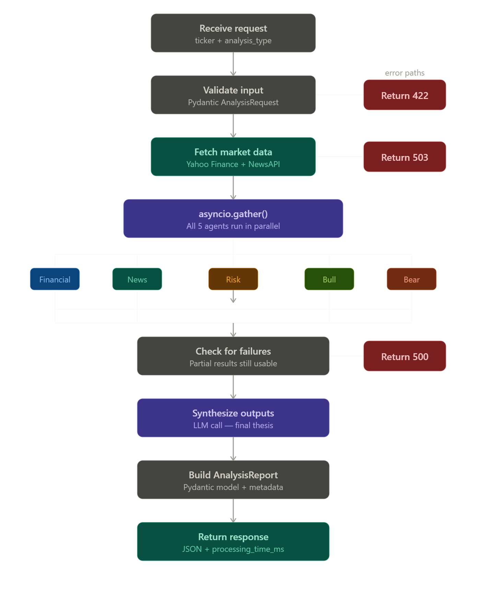

Three design decisions worth understanding:
return_exceptions=True on the gather() call is the most important line. Without it, a single agent timeout crashes the whole request. With it, exceptions are returned as values so you can decide what to do — maybe financial and news succeeded but risk timed out. That's still a usable report.
Fetch data once at the top, then pass it down. Don't let each agent independently call Yahoo Finance — you'll hit rate limits, waste 5x the latency, and get inconsistent numbers if a price ticks between calls. The orchestrator owns data fetching; agents own reasoning.
The AgentOutputs object is what the synthesizer receives, not a raw dict. It's a Pydantic model with optional fields. The synthesizer prompt should tell the LLM to note when certain analyses are missing: "Note: risk analysis was unavailable for this run." That way partial failures are visible in the report rather than silently absent.

The implementation pattern for all five agents is identical:
pythonclass FinancialAgent:
    async def run(self, ticker: str, market_data: dict) -> FinancialOutput:
        prompt = FINANCIAL_PROMPT.format(ticker=ticker, data=market_data)
        raw = await call_llm(prompt)
        return FinancialOutput.model_validate_json(raw)
Each agent is a class with one async def run() method, a Pydantic output model, and a prompt file. That's it — dead simple, easy to test in isolation, easy to mock. Once all five are done, the orchestrator calls them with asyncio.gather() and passes all five outputs to the synthesizer.

In app/graph/workflow.py.
That's the file designated for orchestration logic — the synthesizer is not an agent (it doesn't analyze data independently), it's the final step of the workflow that combines what the agents produced. It lives alongside the AgentOrchestrator class in the same file.
Your workflow.py ends up with three things in it:
app/graph/workflow.py

  AnalysisState          ← the LangGraph state dataclass
  AgentOrchestrator      ← runs the five agents via asyncio.gather()
  Synthesizer            ← combines AgentOutputs into FinalThesis
And call_llm — the shared helper that makes the actual OpenAI call — goes in app/services/llm_service.py. Both the agents and the synthesizer import from there. That way if you swap OpenAI for another provider later, you change one file.
So the import at the top of workflow.py looks like:
pythonfrom app.services.llm_service import call_llm
from app.schemas.outputs import AgentOutputs, FinalThesis
from app.prompts.synthesizer import SYNTHESIZER_PROMPT
And SYNTHESIZER_PROMPT lives in app/prompts/synthesizer.py as a plain string. Keep prompts out of the logic files — you'll be tweaking them constantly and you don't want to touch orchestration code just to adjust wording.
class Synthesizer:
    async def run(self, outputs: AgentOutputs) -> FinalThesis:
        prompt = SYNTHESIZER_PROMPT.format(
            financial = outputs.financial.model_dump_json() if outputs.financial else "unavailable",
            news      = outputs.news.model_dump_json()      if outputs.news      else "unavailable",
            risk      = outputs.risk.model_dump_json()      if outputs.risk      else "unavailable",
            bull      = outputs.bull.model_dump_json()      if outputs.bull      else "unavailable",
            bear      = outputs.bear.model_dump_json()      if outputs.bear      else "unavailable",
        )
        raw = await call_llm(prompt)
        return FinalThesis.model_validate_json(raw)